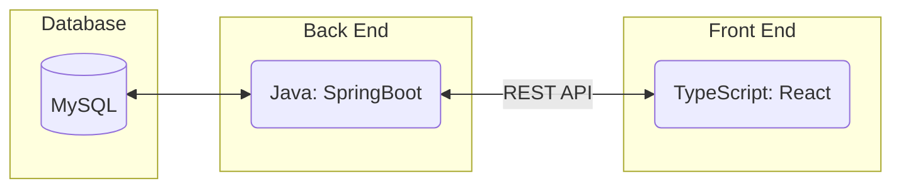
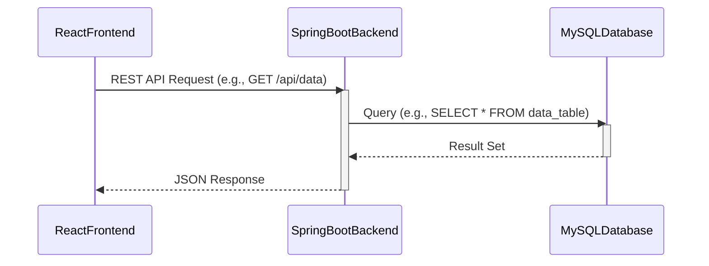

# Note (Updated 2025/01/17)

This was completed as a team project for my COMP SCI 506: Software Engineering class in the Fall semester of 2024.

# Specification Document

Please fill out this document to reflect your team's project. This is a living document and will need to be updated regularly. You may also remove any section to its own document (e.g. a separate standards and conventions document), however you must keep the header and provide a link to that other document under the header.

Also, be sure to check out the Wiki for information on how to maintain your team's requirements.

## TeamName

ARRAY

### Project Abstract

<!--A one paragraph summary of what the software will do.-->

This software will provide a Wordle game that users can play, similar to the ones in the New York Times daily games. Players will have five guesses to guess a five-letter word, which will update every day according to a text file of possible words. The game will be made ourselves; there will be no API requests to an external web server. There will be a leaderboard showing the top scores, and users can register and log in to save their name and score data.

<!-- TODO: include whether or not multiplayer will be implemented, and if scoreboard/leaderboard will show top scores of all time, daily, or both -->

<!--This is an example paragraph written in markdown. You can use *italics*, **bold**, and other formatting options. You can also <u>use inline html</u> to format your text. The example sections included in this document are not necessarily all the sections you will want, and it is possible that you won't use all the one's provided. It is your responsibility to create a document that adequately conveys all the information about your project specifications and requirements.-->

### Customer

<!--A brief description of the customer for this software, both in general (the population who might eventually use such a system) and specifically for this document (the customer(s) who informed this document). Every project will have a customer from the CS506 instructional staff. Requirements should not be derived simply from discussion among team members. Ideally your customer should not only talk to you about requirements but also be excited later in the semester to use the system.-->

This software is designed for a general audience interested in word-guessing games, particularly those who enjoy interactive and competitive gameplay like Wordle. The target users span a wide range of demographics, including casual gamers, puzzle enthusiasts, and competitive players seeking features like high score tracking and gameplay analytics. 

### Specification

<!--A detailed specification of the system. UML, or other diagrams, such as finite automata, or other appropriate specification formalisms, are encouraged over natural language.-->

<!--Include sections, for example, illustrating the database architecture (with, for example, an ERD).-->

ARRAY (T_06) is creating a Wordle-inspired web-based game that incorporates user authentication, real-time gameplay state management, and high score tracking. The frontend is developed with React and TypeScript to deliver a responsive, dynamic user interface with components for login, leaderboard display, and the game board. The backend, built using Java and Spring Boot, handles key logic such as validating user credentials, managing game states, and synchronizing data with the database. MySQL serves as the central storage system, housing player details, game session data, and leaderboard statistics, with JDBC facilitating seamless interaction between the backend and database. All components are containerized using Docker, ensuring consistent deployment across environments, with Docker Compose orchestrating the integration of services. Core features include a secure login/logout system, dynamic game state updates with visual feedback on guesses, streak tracking, and leaderboard updates, creating an engaging and scalable platform for users.

#### Technology Stack

Our technology stack will likely look something like this:

#### Database

The database design supports a Wordle-like game by organizing data into structured, interconnected tables. The `Player` table handles user accounts, storing unique IDs, usernames, emails, passwords, registration dates, online status, and guest information. Each game session is recorded in the `Game` table, which links games to players and logs game dates and the total number of guesses. The `Guess` table tracks individual guesses, including their sequence, the guessed word, and the evaluation result, ensuring accurate tracking of player progress during each game. Words used in the game are managed in the `Word` table, with each word stored alongside the last updated date for version control. The `Leaderboard` and `Ranks` tables capture performance metrics, tracking maximum and current win streaks and assigning ranks based on player achievements.

This database is implemented using Docker, which provides a consistent, portable containerized environment for development and deployment. Docker ensures that the database and related tools can be run seamlessly across different systems, eliminating compatibility issues. The database is paired with phpMyAdmin, a web-based interface that simplifies database management tasks, such as updating words, reviewing player stats, and managing game data. phpMyAdmin ensures the database remains up to date and easy to maintain, even as the game evolves.

Together, these components create a robust backend for the Wordle-like game. The database design efficiently tracks player activity, manages gameplay data, and evaluates performance metrics, enabling features such as leaderboards, player rankings, and gameplay history. The integration with Docker and phpMyAdmin ensures a scalable, maintainable system, supporting smooth gameplay and player engagement over time.

#### Class Diagram

TBD

#### Flowchart

Login:

Game Functionality:

#### Behavior

This flowchart illustrates the gameplay process for a Wordle-like game. The game starts by checking if any attempts (rows) remain; if not, the player loses. The player enters a word, which is validated against the dictionary. Invalid words trigger an error, while valid ones proceed to the next step. If the guessed word matches the target word, all letters turn green, and the player wins. Otherwise, the game evaluates each letter individually. Letters not in the target word are marked grey, letters in the wrong position are yellow, and letters in the correct position turn green. This process repeats until the player guesses correctly or runs out of attempts.

#### Sequence Diagram

### Standards & Conventions

<!--This is a link to a seperate coding conventions document / style guide-->
[Style Guide & Conventions](STYLE.md)
